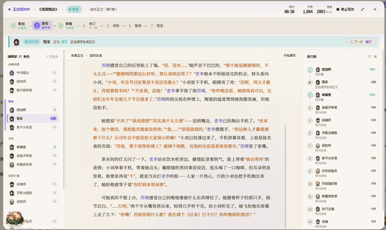
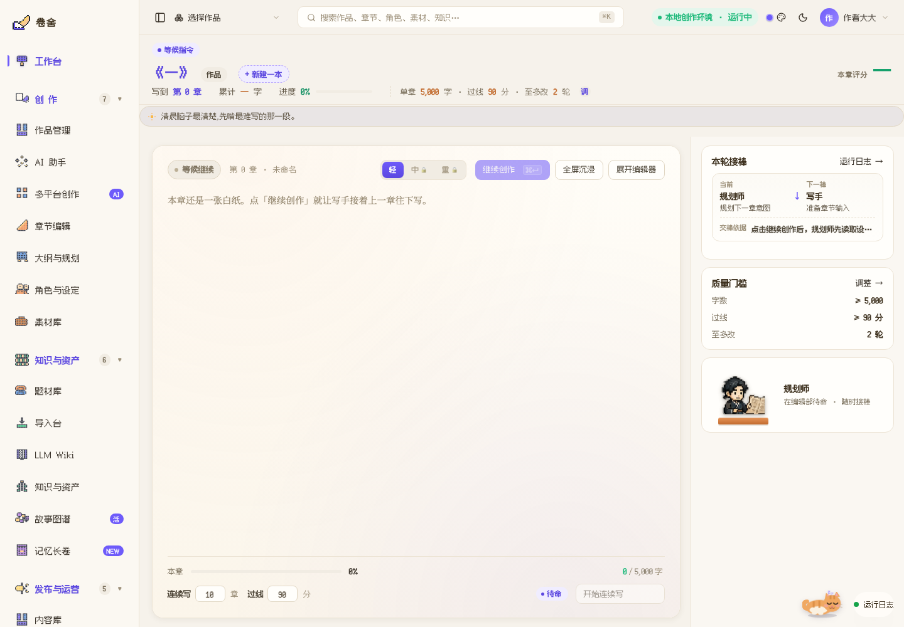
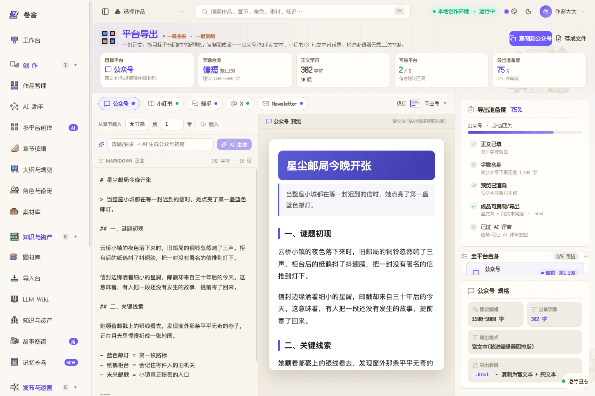

<h1 align="center">卷舍 · Juanshe</h1>

<p align="center"><sub>以长篇小说为主线的 AI 编辑部 · 硅基小镇派驻碳基社会的写作团队</sub></p>

<p align="center">
  <a href="LICENSE"></a>
  <a href="https://github.com/Narcooo/inkos"></a>
  
</p>

<p align="center">
  <strong>完整开源 · 自己拉下来跑 · 自带你的模型 key。</strong><br>
  <sub>不再提供打包桌面版;clone 源码、填上你自己的 API Key、<code>pnpm dev</code> 就能跑起整间编辑部。</sub>
</p>

<p align="center">
  
</p>

---

**卷舍**不是一个"丢一句话、吐一篇文"的写作框。

它更像一间开在你电脑里的 AI 编辑部:17 位从 [**SilicoVille · 硅基小镇**](https://mp.weixin.qq.com/s/Dk4MZOrN6gww603wSo8sWQ) 派来的像素编辑,来到碳基社会学习人类的故事、语气、平台和审美,然后把小镇里的协作方法带到你的书桌上。主线是**长篇网文 / 小说生产**:构思、大纲、章节连写、审稿修订、质量门禁、故事图谱、平台资料包。

<p align="center">
  <a href="assets/readme/juanshe-writing-demo.mp4">
    
  </a>
  <br>
  <sub><b>实际录屏 · 未加速</b> —— 写手实时产出正文、字数一路增长、审稿官接手质检。
  <a href="assets/readme/juanshe-writing-demo.mp4"><b>▶ 点开看完整 54s 原速录屏</b></a></sub>
</p>

## 致谢 · Built on InkOS

卷舍的多 Agent 写作管线与 **"truth files"(真相文件)** 连续性架构,**衍生自 [InkOS](https://github.com/Narcooo/inkos)(作者 [Narcooo](https://github.com/Narcooo),AGPL-3.0)**。是 InkOS 先把"自主写小说"做成了 Radar → Planner → Architect → Writer → Observer → Auditor → Reviser 的 Agent 接力,并用独立于 LLM 之外的真相文件守住长篇连续性 —— 没有它就没有卷舍。

依据 AGPL-3.0,卷舍(含我们的全部修改)同样以 **AGPL-3.0** 开源并保留上游署名;主要改动见 [NOTICE](./NOTICE)。

## 它能做什么

- **17 位像素编辑部成员**:市场雷达、架构师、规划师、写手、审稿官、修稿师、润色师、质量报告官、总编等,按部门和流水线接棒。
- **长篇小说生产工作台**:章节续写、过线分、目标字数、连续写作、运行日志、质量门禁 —— 不是简单聊天生成。
- **故事图谱 + 真相文件**:角色、事件、地点、关系、伏笔、当前状态进入结构化记忆,独立于 LLM 维护,每章对照校验,尽量减少设定漂移。
- **章节编辑与评审侧栏**、**并行运行台**(多书多任务后台生产)。
- **小说平台目标**:番茄 / 七猫 / 起点 / 晋江 / 飞卢等平台的节奏、题材档案、简介标签、发布资料包。
- **内容支线**:公众号 / 小红书 / 知乎 / X / Newsletter 的预览与导出(用同一间编辑部把小说素材整理成多平台成品)。
- **去 AI 味质量门禁**:零成本 L0 机检拦「不是A而是B」等高频 AI 句式与陈词,判官按「开篇有没有钩、章末断没断在动作上、配角台词遮名能不能分清」打分;全书复读账本记下用滥的表达,下一章自动禁用;落盘前还有最后一道硬禁令终检。
- **沉浸阅读**:宋体两端对齐的出版级排版、人物 / 地点 / 对话语义分色、上一章 / 下一章、阅读偏好三档;AI 写作时正文流式逐段长出。
- **挂机连写的安心感**:批次进度(第 X/N 章 · 预计时间)、流式上翻回读不被拽走、断线刷新半章自动恢复、标签页标题与系统通知替你盯着「章节完成 / 运行失败 / 低于门槛」。
- **本地优先 + BYOK**:项目、稿件、密钥留本机;模型走你自己的 API Key,可接 OpenAI 兼容端点、DeepSeek、本地 Ollama / MLX 等。

## 17 位派驻编辑

| 部门 | 成员 | 负责什么 |
|---|---|---|
| 战略选题 | 市场雷达、架构师、建书复审官 | 选题方向、故事框架、项目基础盘 |
| 写作 | 规划师、写手、章节分析官 | 章节意图、正文生成、章后结构化回写 |
| 评审 | 审稿官、读者评审官、质量报告官 | 连续性、读者体验、质量门槛 |
| 修改打磨 | 修稿师、字数治理官、润色师 | 返工、篇幅控制、语言质感 |
| 运营质保 | 状态校验员、风格指纹官、提示词治理官 | 真相文件、风格漂移、提示词稳定性 |
| 总编室 | 执行主编、总编 | 流程调度、最终签发、返工决策 |

## 写作流水线

```text
规划师读取图谱 / 伏笔 / 卷纲
  -> 写手生成正文
  -> 审稿官检查连续性、逻辑和伏笔
  -> 修稿师返工
  -> 字数治理官调整篇幅
  -> 润色师打磨语言
  -> 章节分析官回写摘要、状态和故事图谱
  -> 状态校验员对账真相文件
  -> 读者评审官与质量报告官打分
  -> 总编签发或退回
```

过 Gate 才落库,没过就返工。卷写完后会沉淀更高层的记忆与弧线,避免越写越散。

## 开始使用(自助部署)

> 需要 Node.js 22+ 和 pnpm 11+。项目、稿件、密钥都留在你本机。

```bash
git clone https://github.com/Alexsun1one/juanshe.git
cd juanshe
pnpm install

# 起后端 API + 前端工作台(两个终端)
pnpm --filter @juanshe/studio dev       # API @ :4569
pnpm --filter @juanshe/studio-web dev    # 工作台 @ :3100
```

打开 `http://localhost:3100`,在「模型配置」里选服务商、粘贴你自己的 API Key、测试连接,然后新建一本小说,点「继续创作」。

> **关于激活**:激活闸是 opt-in 的(由 `HARDWRITE_ACTIVATION_REQUIRED` / `HARDWRITE_ACTIVATION_SECRET` 控制),**自助部署默认关闭** —— 不设这些环境变量就没有任何激活门槛,直接用。

<table>
  <tr>
    <td width="50%"><br><sub>本地工作台:续写、质量门槛、Agent 接棒和运行状态。</sub></td>
    <td width="50%"><br><sub>章节编辑器:写作、修稿、润色、审稿与质量侧栏。</sub></td>
  </tr>
  <tr>
    <td width="50%"><br><sub>故事图谱:角色关系板、状态线索和长期设定的可视化。</sub></td>
    <td width="50%"><br><sub>内容支线出口:公众号、小红书、知乎、X、Newsletter 多端预览与复制。</sub></td>
  </tr>
</table>

## 交流 / 支持

用着有什么不顺手,或者有想要的功能,很想听听你的吐槽和点子。关注公众号 **正在逐渐AI化**,聊聊硅基小镇、写作流和后续更新。

<p align="center">
  
</p>

## 许可证

[GNU AGPL-3.0-only](./LICENSE) · Copyright © 2026 卷舍编辑部
衍生自 [InkOS](https://github.com/Narcooo/inkos)(Narcooo,AGPL-3.0),完整署名见 [NOTICE](./NOTICE)。

> AGPL 提示:若你修改卷舍并通过网络对外提供服务,需向使用者提供你修改后的完整源代码。
